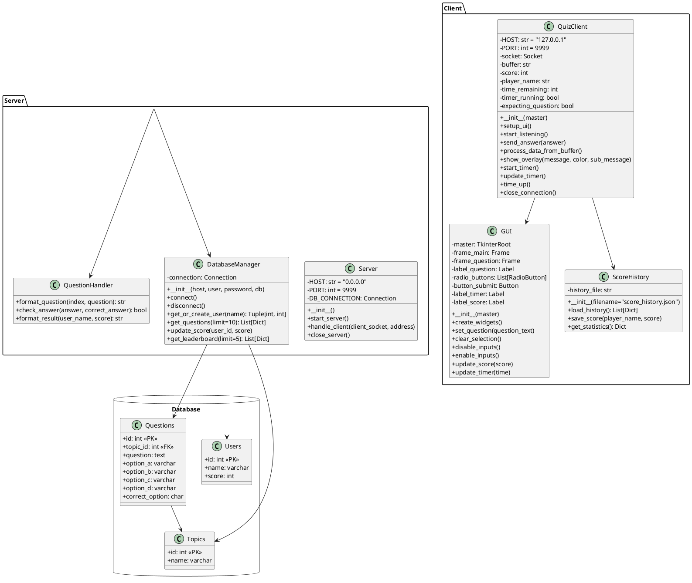
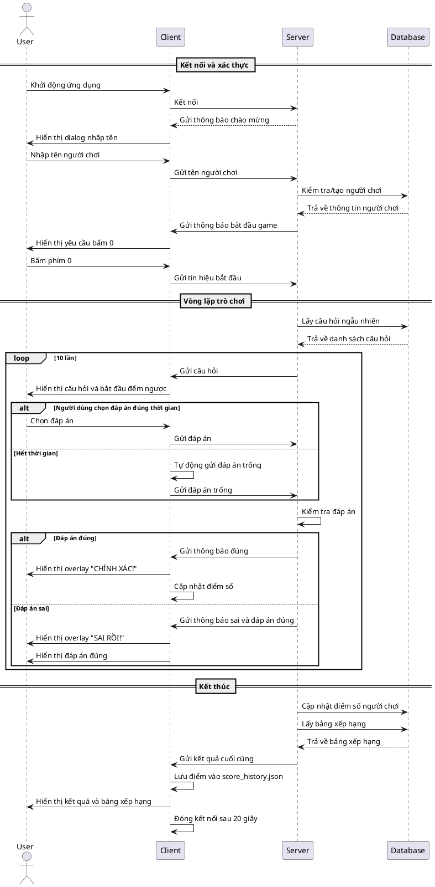
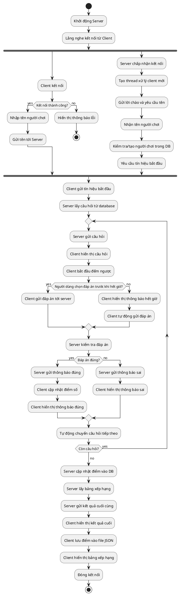
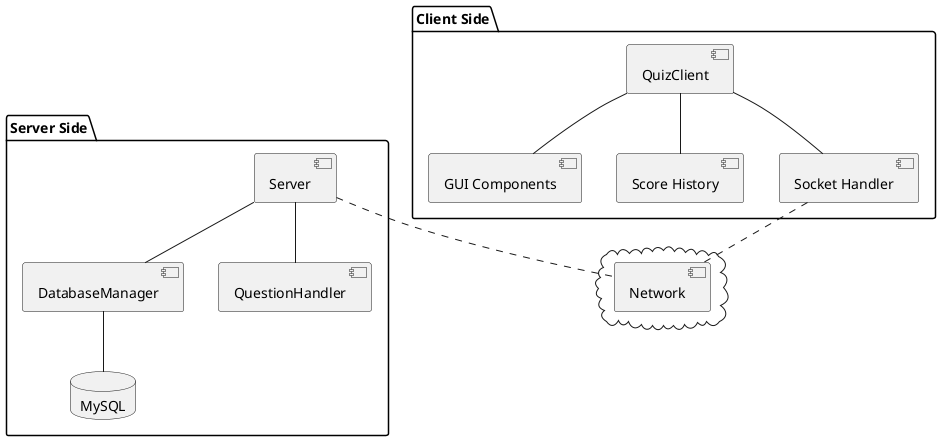
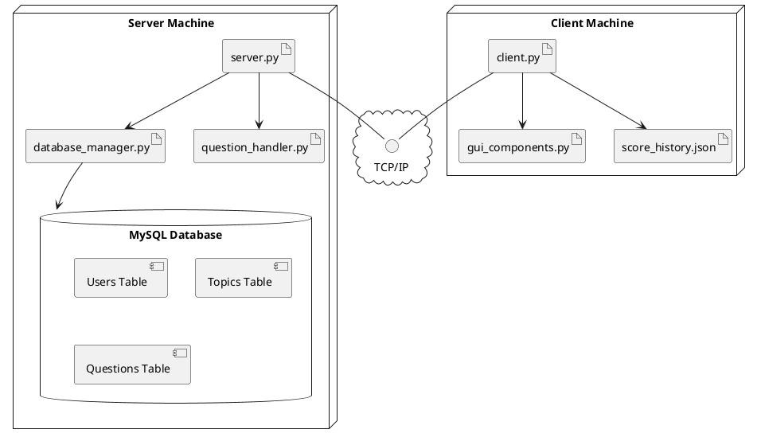
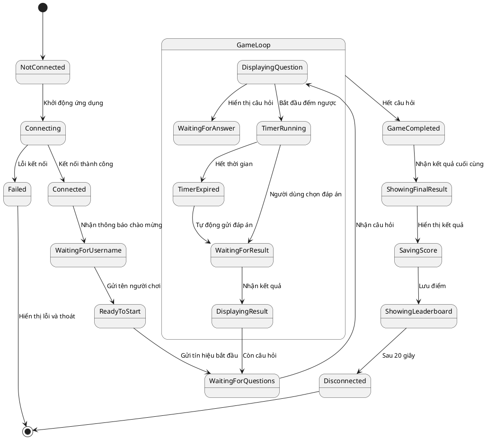
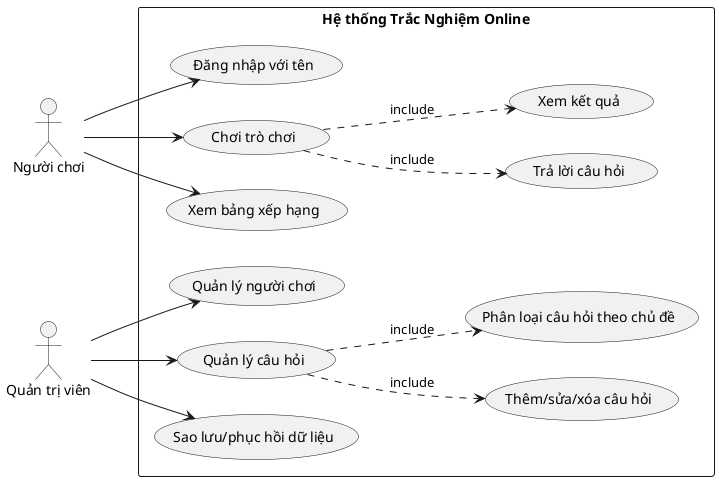

# Biểu Đồ UML (PlantUML)

Các biểu đồ dưới đây mô tả hệ thống Trắc Nghiệm Online bằng cú pháp PlantUML.

## 1. Sơ đồ lớp (Class Diagram)



## 2. Sơ đồ tuần tự (Sequence Diagram)



## 3. Sơ đồ hoạt động (Activity Diagram)



## 4. Sơ đồ thành phần (Component Diagram)



## 5. Sơ đồ triển khai (Deployment Diagram)



## 6. Sơ đồ trạng thái (State Diagram)



## 7. Sơ đồ usecase (Use Case Diagram)



## 8. Sơ đồ gói (Package Diagram)

```plantuml
@startuml
package "Server" {
    package "Core" {
        [Server]
        [ClientHandler]
        [ThreadManager]
    }

    package "Database" {
        [DatabaseManager]
        [QueryBuilder]
        [ConnectionPool]
    }

    package "Game Logic" {
        [QuestionHandler]
        [ScoreCalculator]
        [LeaderboardManager]
    }
}

package "Client" {
    package "Network" {
        [SocketHandler]
        [DataReceiver]
        [DataSender]
    }

    package "UI" {
        [MainWindow]
        [QuestionUI]
        [ResultUI]
        [LeaderboardUI]
    }

    package "Logic" {
        [GameController]
        [TimerManager]
        [ScoreTracker]
    }

    package "Storage" {
        [LocalStorage]
        [ScoreHistory]
    }
}

[Server] ..> [ClientHandler]
[Server] ..> [ThreadManager]
[ClientHandler] ..> [DatabaseManager]
[ClientHandler] ..> [QuestionHandler]
[DatabaseManager] ..> [QueryBuilder]
[DatabaseManager] ..> [ConnectionPool]
[QuestionHandler] ..> [ScoreCalculator]
[ScoreCalculator] ..> [LeaderboardManager]

[GameController] ..> [SocketHandler]
[SocketHandler] ..> [DataReceiver]
[SocketHandler] ..> [DataSender]
[GameController] ..> [QuestionUI]
[GameController] ..> [ResultUI]
[GameController] ..> [TimerManager]
[GameController] ..> [ScoreTracker]
[ScoreTracker] ..> [LocalStorage]
[LocalStorage] ..> [ScoreHistory]
[GameController] ..> [LeaderboardUI]
@enduml
```
